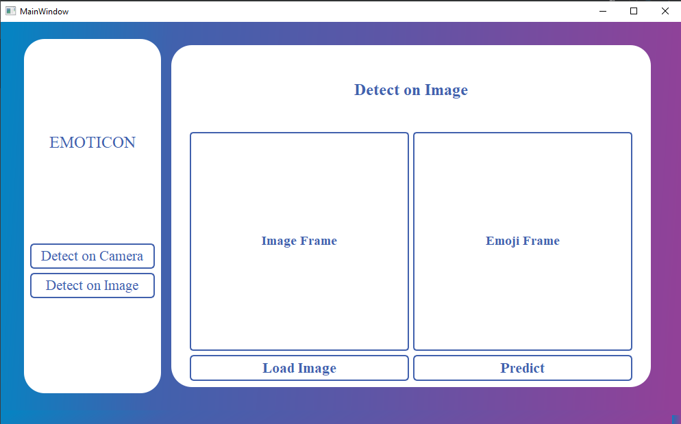
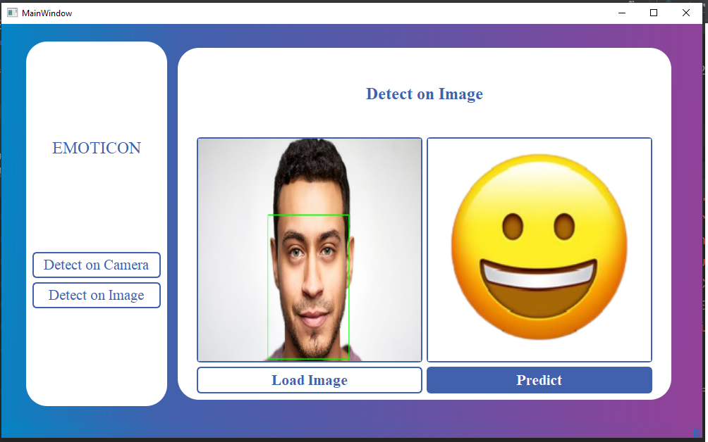

# Emoji_Detector





This is the project in which we predict mood of the inputted face image.
Following are the emotions it can predict:

1. Angry
2: Disgusted
3: Emoji 
4: Fearful
5: Happy
6: Neutral 
7: Sad
8: Surprised

To install the requirements enter the following command in to your console

```pip install -r requirements.txt```

To run the main script type:

```python main.py```

